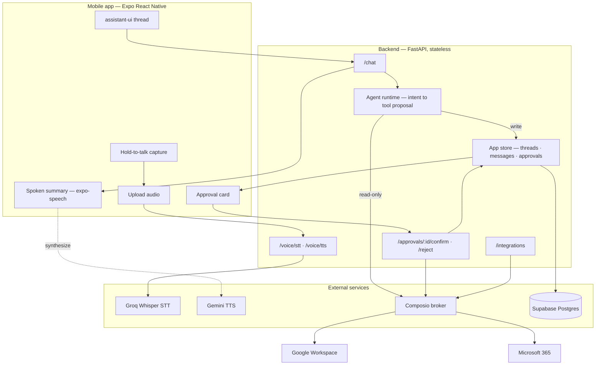

# Voice AI Workspace Agent

A voice-first mobile agent that runs your Google Workspace and Microsoft 365 by speaking, and refuses to touch anything risky without your approval.

## What it does

Hold the talk button and speak. The app records the turn, sends the audio to Groq Whisper for transcription, and hands the text to the agent. The agent decides what workspace action the request maps to, runs read-only actions immediately, and pauses on any write until you confirm it. The result comes back as text in the thread and as a short spoken summary through Gemini TTS.

A typical turn:

- "Show my calendar today" transcribes, runs `GOOGLECALENDAR_FIND_EVENT` through Composio, and reads the result back.
- "Email alex@acme.com the notes" transcribes, drafts the send, and stops. An approval card appears with the exact recipient, subject, and body. Nothing is sent until you tap confirm.
- "Stop" or "never mind" cancels the turn, stops playback, and returns to idle.

Voice is the primary surface, but text input works for every path, and a short follow-up window after each spoken reply lets you continue without repeating the trigger.

## The reliability posture

This is the part the project is built around. A mobile app that talks to third-party APIs cannot promise perfect uptime, so the design targets high reliability, fast recovery, and zero silent failure instead.

**Approval-gated writes.** The agent never sends an email, creates a meeting with attendees, shares a file, posts to a shared space, or deletes data on its own. Those actions become a pending approval record with the full tool name and arguments attached. The write only executes after an explicit confirm, and the confirm endpoint re-checks that the approval belongs to the requesting user and is still pending before it runs — a rejected or already-resolved approval returns a `409` and performs no side effect. Read-only actions (listing calendars, searching files) skip the gate.

**Audit trail.** Every thread, message, approval, and connected account is a durable record. When a database is configured they persist to Supabase Postgres; without one the same store runs in memory so the flow still works end to end. Each approval keeps who requested it, the tool, the arguments, and its resolution, so any write can be reconstructed after the fact.

**Graceful degradation.** Missing configuration downgrades instead of crashing. With no Composio key, tool execution returns a labeled dry-run result rather than an error. With no STT or TTS key, the voice service returns an empty transcript or text-only response and the thread keeps working. If a Composio account is absent or not yet ready, the agent says so in plain language and points you to the Integrations screen instead of failing silently. On the client, a failed transcription or tool call surfaces a spoken and on-screen recovery message, and TTS failure still leaves the text reply in the thread.

## Architecture

Two apps: an Expo React Native client and a stateless FastAPI backend. The backend owns the agent, the approval state machine, the voice pipeline, and the Composio broker.



The agent runtime classifies each turn against a stable internal tool surface (`GMAIL_SEND_EMAIL`, `GOOGLECALENDAR_CREATE_EVENT`, `GOOGLECALENDAR_FIND_EVENT`, and the Drive/Outlook/Teams/OneDrive slugs the broker recognizes) and decides read versus write. Writes produce a tool proposal plus a pending approval; reads execute directly through the Composio client. The client is resolved per user, matched to a connected account, and only invoked once a ready account exists.

DeepAgents on LangGraph is the orchestration layer the architecture is designed around — a graph of `intent_router → account_guard → planner → approval_guard → executor → summarizer`. The backend currently ships a deterministic intent router that enforces the same approval-gated contract and tool surface, which is the layer DeepAgents slots into next.

## Stack

| Layer | Choice |
|-------|--------|
| Mobile | Expo (React Native), assistant-ui, Zustand, expo-av, expo-speech |
| Backend | FastAPI, Pydantic, SQLAlchemy |
| Agent orchestration | DeepAgents (LangGraph) target; deterministic intent router shipped |
| Integrations | Composio for Google Workspace and Microsoft 365 |
| Speech-to-text | Groq Whisper (`whisper-large-v3-turbo`) |
| Text-to-speech | Gemini TTS (`gemini-2.5-flash-preview-tts`) |
| Reasoning model | Gemini 2.5 Flash (provider-configurable) |
| Data and state | Supabase Postgres, with an in-memory fallback store |
| Object storage | Supabase Storage or S3-compatible |

Providers are selected through environment variables, not hard-coded — STT, TTS, and the LLM can each be swapped to OpenAI, Deepgram, ElevenLabs, or Google without code changes.

## Quickstart

The full environment contract is in [docs/ENVIRONMENT.md](docs/ENVIRONMENT.md), with a starter at [.env.example](.env.example). The backend reads, in order, `.env`, `apps/server/.env`, `.env.local`, then `apps/server/.env.local`; later files override earlier ones. The simplest setup is a single root `.env.local`.

Recommended first provider set:

```bash
LLM_PROVIDER=google
LLM_MODEL=gemini-2.5-flash
STT_PROVIDER=groq
STT_MODEL=whisper-large-v3-turbo
TTS_PROVIDER=google
TTS_MODEL=gemini-2.5-flash-preview-tts
TTS_VOICE=Kore
```

The backend runs without secrets — it falls back to an in-memory store and dry-run tool execution — so you can bring it up first and add keys as you connect real services.

**Backend**

```bash
cd apps/server
python3 -m venv .venv
source .venv/bin/activate
pip install -r requirements.txt
uvicorn app.main:app --reload
```

**Mobile**

```bash
cd apps/mobile
npm install
npm run start
```

Point the client at the backend with `EXPO_PUBLIC_API_URL` and `EXPO_PUBLIC_WS_URL`. Voice capture, wake word, and background listening require a development build rather than Expo Go.

## Status

This is a portfolio project and a working full-stack scaffold, not a shipped product.

Working end to end today:

- Voice capture, real Groq Whisper transcription, and Gemini TTS playback on device
- Chat, threads, and the approval confirm/reject flow, with Postgres or in-memory persistence
- Gmail and Google Calendar happy paths through Composio, with dry-run fallback when unconfigured
- Composio account linking and status resolution on the Integrations screen
- A backend test suite covering health, chat flow, approvals, voice, integrations, and the store

Designed and next in line:

- DeepAgents/LangGraph replacing the deterministic router
- On-device wake word, VAD, and armed background listening (needs a native development build)
- Drive, Docs, Sheets, Outlook, Teams, OneDrive, and To Do coverage
- Retry queues, webhook-driven reconnect, and production observability

Architecture and design detail live in [docs/ARCHITECTURE-v2.md](docs/ARCHITECTURE-v2.md), [docs/LLD-Voice-AI-Agent.md](docs/LLD-Voice-AI-Agent.md), and [docs/UI-SYSTEM.md](docs/UI-SYSTEM.md).

---

Built by Mugilan Sakthivel — [mugilans.in](https://mugilans.in)
