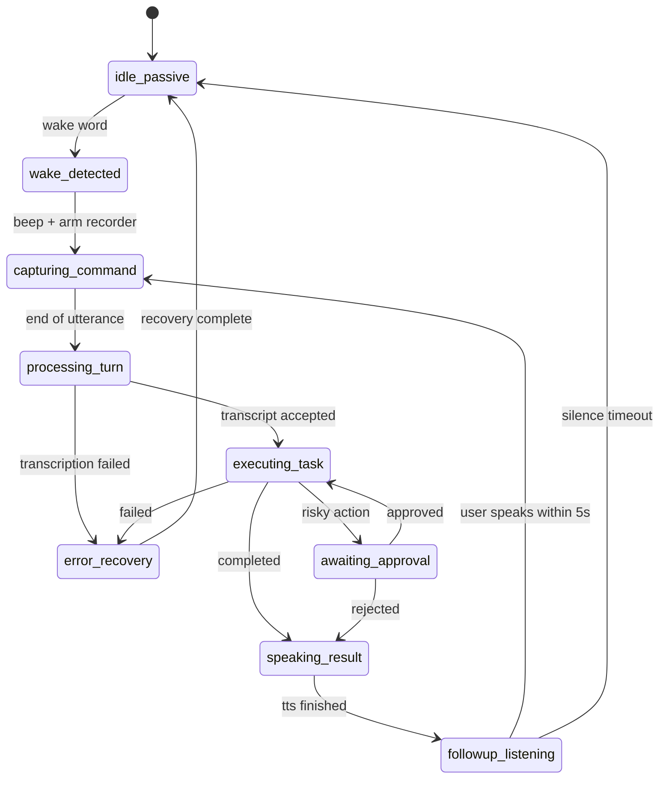

# Low-Level Design: Voice AI Workspace Agent

## Document Info
- Version: 4.0
- Date: 2026-03-30
- Status: Design baseline for implementation
- Architecture Direction: Voice-first, Composio-first, DeepAgents orchestration

---

## 1. Product Direction

### 1.1 Vision
Build a cross-platform mobile voice assistant that helps users operate Google Workspace and Microsoft 365 by voice, with safe approvals for risky actions and a clean chat UI as fallback.

The product should feel like this:
- user says the wake word
- app captures only the speech after the wake word
- app gives a short acknowledgment when needed
- backend performs the work
- app speaks a brief outcome
- app keeps a short follow-up window open for continued conversation

### 1.2 What We Are Actually Building
We are not building a magical system that works as an always-on assistant in every app lifecycle state on every mobile OS.

We are building the strongest practical version that mobile platforms allow:
- Android: background listening mode with a microphone foreground service
- Android advanced mode: optional assistant-role mode using `VoiceInteractionService`
- iOS: armed background listening while the audio session is active
- iOS limitation: no promise of true always-on wake word after the app is fully terminated

### 1.3 Core Goals
- wake-word driven interaction instead of push-to-talk as the target product mode
- event-driven voice experience, not timer spam
- short spoken acknowledgments and brief outcomes
- approvals for risky side effects
- Composio as the action layer for Google Workspace and Microsoft 365
- DeepAgents as the planning and orchestration layer
- strong reliability, observability, and graceful degradation

### 1.4 Non-Goals for v1
- direct provider-owned Google or Microsoft integration in our backend
- fully general Meta integration in v1
- guaranteed always-on hotword after full app termination on iOS
- long spoken monologues from the assistant
- second-by-second progress narration

### 1.5 Key Decisions

| Area | Decision |
|------|----------|
| Agent runtime | DeepAgents |
| Workspace integrations | Composio |
| Primary platforms | iOS + Android mobile |
| Voice UX target | Wake word + short command window + follow-up window |
| Audio control | Native-capable Expo development build, not Expo Go |
| Wake word | On-device engine |
| Endpointing | On-device VAD plus end-of-utterance logic |
| Risk control | Approval gates + idempotency + audit log |
| Persistence | Supabase Postgres and storage |
| Background task model | Stateless API + DB-backed worker execution |

---

## 2. Platform Capability Baseline

### 2.1 Capability Matrix

| Capability | Android | iOS |
|------|--------|-----|
| Foreground wake word while app open | Yes | Yes |
| Background listening while app is armed | Yes, with microphone foreground service | Limited but feasible while audio session remains active |
| True assistant-role mode | Yes, with `VoiceInteractionService` | No equivalent product path |
| Fully closed app always-on wake word | Not a safe default promise | No |
| Local beep and short TTS feedback | Yes | Yes |
| Follow-up conversation window | Yes | Yes |
| Barge-in while assistant speaks | Yes | Yes |

### 2.2 Product Modes

#### Mode A: Foreground Conversation Mode
The user is in the app. This is the simplest and highest-confidence mode.

#### Mode B: Armed Background Listening Mode
The user explicitly enables background listening.

Behavior:
- Android keeps a foreground service and persistent notification
- iOS keeps the audio session and background recording active while allowed

#### Mode C: Android Assistant Mode
Optional advanced mode where the app can be set as the device assistant using native Android assistant APIs.

This is not required for the first implementation, but the architecture should leave room for it.

---

## 3. User Experience Design

### 3.1 Primary Voice Flow

```text
Passive wake word
  -> wake word detected
  -> beep
  -> command capture starts
  -> user finishes speaking
  -> assistant gives one short acknowledgment if needed
  -> backend performs the task
  -> assistant gives a brief result
  -> app listens for 5 seconds for a follow-up
  -> if follow-up arrives, continue same conversation
  -> otherwise return to passive wake-word mode
```

### 3.2 Spoken Response Policy
The assistant must not narrate every internal step.

Rules:
- do not speak while the user is still speaking
- give one short acknowledgment after end-of-utterance, only if useful
- do not repeat progress every second
- speak when one of these events happens:
  - command accepted
  - approval required
  - clarification required
  - task completed
  - task failed in a user-visible way

Allowed acknowledgment examples:
- "Got it."
- "Checking that."
- "On it."
- "I will let you know if approval is needed."

Allowed completion style:
- "Meeting created."
- "I found the file."
- "I need approval before sending that."

### 3.3 Approval UX
If the user asks for a risky action:
- the assistant pauses before execution
- the app shows an approval card
- the assistant speaks a short approval prompt
- after approval, execution resumes

Example:
```text
User: "Hey Nova, send this update to the team"
Assistant: "Got it. I will let you know if approval is needed."
Assistant: "I need approval before sending this email."
User approves
Assistant: "Sent."
```

### 3.4 Follow-Up Conversation Window
After the assistant finishes speaking:
- keep the microphone open for 5 seconds
- if the user speaks, continue the same conversation without another wake word
- if silence persists, return to passive wake-word listening

This creates a more natural two-way loop while still keeping power usage controlled.

### 3.5 Stop and Cancel Behavior
The user must always be able to stop the interaction.

Supported stop intents:
- "stop"
- "cancel"
- "never mind"
- "stop listening"

Effects:
- stop TTS immediately
- cancel in-progress local recording
- cancel follow-up window
- if safe, cancel queued backend work
- return to passive wake-word mode

---

## 4. Voice State Machine

### 4.1 High-Level States

| State | Meaning |
|------|---------|
| `idle_passive` | Wake-word engine armed, waiting for keyword |
| `wake_detected` | Wake word recognized |
| `capturing_command` | Recording user speech after wake word |
| `processing_turn` | Uploading or transcribing captured speech |
| `executing_task` | Backend is performing the requested work |
| `awaiting_approval` | Risky action paused pending approval |
| `speaking_result` | Assistant is playing spoken output |
| `followup_listening` | 5-second post-response conversation window |
| `error_recovery` | User-visible failure state |

### 4.2 State Transitions



### 4.3 Event-Driven Prompts
Prompts are tied to state transitions, not recurring timers.

| Event | Spoken output |
|------|---------------|
| Wake word detected | beep only |
| Command fully captured | optional short acknowledgment |
| Approval required | short approval request |
| Successful completion | brief result |
| Recoverable failure | brief failure with next step |
| Follow-up timeout | no speech, silently return to passive mode |

---

## 5. Audio Pipeline Design

### 5.1 Pipeline Stages

```text
Microphone
  -> noise handling
  -> wake word engine
  -> voice activity detection
  -> command recorder
  -> STT
  -> DeepAgents
  -> response text
  -> TTS
  -> playback
  -> follow-up listening
```

### 5.2 Audio Components

#### `WakeWordEngine`
Responsibilities:
- listen continuously for one or more wake words
- run on-device
- expose `start()`, `stop()`, and `onDetection()`

Suggested implementation:
- Porcupine or equivalent on-device wake-word engine

#### `VoiceActivityDetector`
Responsibilities:
- detect speech onset
- detect speech end
- suppress empty captures
- decide when to end the command window

Suggested implementation:
- Cobra or equivalent local VAD

#### `CommandCaptureRecorder`
Responsibilities:
- start immediately after wake word
- record only the post-wake command turn
- keep a small ring buffer to avoid clipping the first spoken word
- stop when VAD says utterance is complete

#### `SpeechPlaybackController`
Responsibilities:
- play short beeps and spoken responses
- stop playback immediately on barge-in
- notify when playback completes so follow-up listening can begin

### 5.3 Endpointing Rules
- if no speech begins shortly after wake word, end capture quietly
- if the user begins speaking, keep recording until end-of-utterance
- if the user pauses briefly mid-thought, do not end too early
- if the user barges in while assistant is speaking:
  - stop playback
  - clear remaining output
  - enter `capturing_command`

### 5.4 Efficiency Rules
- wake-word detection stays on-device
- only stream or upload speech after the wake word
- do not send continuous raw background audio to the backend
- use mono PCM with reduced sample rate where supported
- stop recorders aggressively after end-of-utterance
- keep the follow-up window short

---

## 6. Mobile Architecture

### 6.1 Mobile Subsystems

```text
Mobile App
  - Voice Orchestrator
  - Wake Word Engine Adapter
  - VAD Adapter
  - Recorder Controller
  - Playback Controller
  - assistant-ui chat surfaces
  - Approval UI
  - Integration UI
  - Background Listening Controller
```

### 6.2 Key Modules

#### `VoiceOrchestrator`
Owns the voice state machine.

Responsibilities:
- transition among voice states
- coordinate wake word, VAD, recorder, STT, TTS, and follow-up windows
- enforce stop/cancel behavior
- feed messages into the chat thread

#### `BackgroundListeningController`
Responsibilities:
- enable and disable armed listening mode
- show system-visible background status
- configure audio session or foreground service
- prevent duplicate audio sessions

#### `ConversationSessionController`
Responsibilities:
- keep track of the active conversation ID
- manage the 5-second follow-up window
- decide whether a new utterance belongs to the current conversation

#### `ConnectorStore`
Responsibilities:
- track connected accounts
- track account status and auth expiry
- surface Google, Microsoft, and future Meta connection state to the UI

### 6.3 Expo / Native Build Requirement
This app must use an Expo development build with native modules.

Reason:
- wake-word engines require native integration
- background audio control requires native-capable configuration
- production-quality background recording is not an Expo Go use case

### 6.4 UI Surfaces

#### Primary Surfaces
- chat screen
- voice status pill
- hold-to-talk fallback control
- approval card
- integrations screen
- settings screen for background listening

#### Integrations Screen
The app must include a dedicated connector screen.

Sections:
- Google Workspace
- Microsoft 365
- Meta

For each provider:
- connection status
- last sync / last check
- connect button
- reconnect button
- disconnect button
- supported actions summary

### 6.5 Meta UI Position
Meta UI can be present early, but must be labeled honestly.

Recommended behavior:
- if only Meta Ads is supported, label it `Meta Ads`
- if broader Meta surfaces are not implemented, show `Coming soon` instead of implying support

---

## 7. Backend Architecture

### 7.1 Backend Components

```text
FastAPI API
  -> Session and thread APIs
  -> Voice ingress APIs
  -> Approval APIs
  -> Integration APIs
  -> WebSocket updates

DeepAgents Layer
  -> intent router
  -> planner
  -> account guard
  -> approval guard
  -> executor
  -> summarizer

Action Layer
  -> Workspace Action Broker
  -> Composio client
  -> result normalizer

Persistence
  -> Supabase Postgres
  -> object storage for audio and artifacts
  -> audit/event tables
```

### 7.2 Backend Request Model

#### Voice Command Path
1. mobile uploads audio or transcript
2. backend transcribes if needed
3. backend resolves the conversation session
4. DeepAgents plans the work
5. broker resolves the correct connected account
6. Composio executes the action or prepares an approval
7. backend sends:
   - assistant text
   - approval payload if needed
   - completion or failure summary

#### Async Work Path
Long-running actions should not block the mobile voice loop.

Design:
- API writes a job row to Postgres
- worker picks up pending jobs
- worker emits status updates back to the thread
- mobile app receives updates by polling or WebSocket

### 7.3 Primary Endpoints
- `POST /api/v1/chat`
- `POST /api/v1/voice/stt`
- `POST /api/v1/voice/tts`
- `POST /api/v1/integrations/composio/connect`
- `GET /api/v1/integrations/accounts`
- `POST /api/v1/approvals/{approval_id}/confirm`
- `POST /api/v1/approvals/{approval_id}/reject`
- `GET /ws/chat/{thread_id}`

### 7.4 WebSocket Event Model

Events:
- `assistant_ack`
- `assistant_token`
- `assistant_final`
- `approval_required`
- `job_started`
- `job_completed`
- `job_failed`
- `integration_updated`

---

## 8. Agent and Action Design

### 8.1 DeepAgents Responsibilities
- understand user requests
- decide whether a request is read-only or write-capable
- choose the smallest safe action plan
- route through approvals where required
- summarize outcomes briefly

### 8.2 Stable Internal Tool Surface
The agent should operate against stable internal names, even if Composio tool slugs evolve.

Examples:
- `google_calendar.create_event`
- `google_gmail.send_email`
- `google_drive.search_files`
- `microsoft_outlook.send_email`
- `microsoft_teams.post_message`
- `microsoft_onedrive.list_files`
- `meta_ads.get_campaigns`

### 8.3 Approval Policy
Approval required:
- sending email
- sending messages to shared channels
- creating meetings with external attendees
- sharing files externally
- deleting or modifying user-owned data

Approval skipped:
- read-only search
- listing files
- listing events
- draft generation without delivery

### 8.4 Result Summarization Rules
The backend returns two forms:
- full thread text for the UI
- short spoken result for voice playback

Example:
- full text: "I created the meeting for tomorrow at 3 PM with Alex and added the Zoom link."
- short spoken result: "Meeting created for tomorrow at 3."

---

## 9. Connected Account and Connector Design

### 9.1 Provider Support Plan

| Provider | v1 plan |
|------|---------|
| Google Workspace | Yes |
| Microsoft 365 | Yes |
| Meta Ads | Optional if Composio action coverage is confirmed for the target use case |
| General Meta social / DM surfaces | Later, only after exact scope is defined |

### 9.2 Connection Flow
1. user opens integrations screen
2. user taps `Connect Google` or `Connect Microsoft`
3. mobile app requests a Composio connect link
4. user completes provider OAuth
5. backend refreshes connected accounts
6. UI shows connected status and supported capabilities

### 9.3 Account Resolution
Each action request must resolve:
- which provider suite it belongs to
- which connected account to use
- whether the required scope is available

If multiple accounts are connected:
- prefer the explicitly selected default
- otherwise ask the user one short clarification

---

## 10. Data Model

### 10.1 Core Tables
- `users`
- `threads`
- `messages`
- `approvals`
- `connected_accounts`
- `conversation_sessions`
- `voice_events`
- `jobs`
- `job_events`
- `tool_executions`

### 10.2 `conversation_sessions`
Tracks the currently active conversational loop.

Fields:
- `id`
- `user_id`
- `thread_id`
- `state`
- `source_mode` (`foreground`, `background`, `assistant_role`)
- `wake_word_detected_at`
- `command_completed_at`
- `followup_expires_at`
- `last_output_at`
- `created_at`
- `updated_at`

### 10.3 `voice_events`
Audit log for audio-state transitions.

Fields:
- `id`
- `conversation_session_id`
- `event_type`
- `metadata`
- `created_at`

Example event types:
- `wake_word_detected`
- `recording_started`
- `recording_stopped`
- `speech_started`
- `speech_ended`
- `tts_started`
- `tts_stopped`
- `followup_window_started`
- `followup_window_expired`

---

## 11. Reliability and Safety

### 11.1 Reliability Principles
- no silent failures
- no hidden side effects
- local audio state must always be recoverable
- voice failures degrade to text
- background listening can be disabled instantly

### 11.2 Audio Safety Rules
- never keep multiple recorders active at the same time
- stop TTS on user barge-in
- always expose a visible listening indicator
- on Android, always show the foreground-service notification while background listening is active

### 11.3 Error Handling

If wake word engine fails:
- disable armed listening
- keep push-to-talk available

If STT fails:
- say a short retry prompt or show transcript error

If backend action fails:
- speak a brief failure message
- show full details in the thread

If approval expires:
- mark it rejected
- tell the user the action was not performed

### 11.4 Observability
Every request and action should carry:
- request ID
- thread ID
- conversation session ID
- user ID
- connected account ID
- provider execution ID if available

---

## 12. Privacy and Security

### 12.1 Privacy Model
- wake-word detection is local
- only post-wake speech is sent for STT or backend processing
- provider tokens remain managed through Composio in v1
- risky actions require approval

### 12.2 User Controls
The user must be able to:
- turn background listening on or off
- choose the wake word if supported
- disable spoken playback
- clear conversation history
- disconnect accounts

### 12.3 Secrets
Required runtime secrets remain:
- Supabase keys
- Composio keys
- provider model keys
- encryption key

---

## 13. Implementation Phases

### Phase 1: Reliable Foreground Voice
- hold-to-talk remains available
- real STT and TTS
- chat and approval loop
- integrations screen for Google and Microsoft

### Phase 2: Armed Listening Mode
- wake word engine
- local VAD
- event-driven voice loop
- follow-up window
- stop/cancel voice commands

### Phase 3: Background Listening
- Android microphone foreground service
- iOS armed background listening where supported
- persistent status indicators

### Phase 4: Android Assistant Mode
- native `VoiceInteractionService`
- assistant-role onboarding
- deeper system integration

### Phase 5: Meta Expansion
- add exact Meta use case once scope is confirmed
- keep UI honest about what is actually supported

---

## 14. Build Checklist

### Mobile
- Expo development build configured
- native wake-word integration added
- VAD integration added
- background listening service/controller added
- integrations screen implemented
- settings screen for voice mode implemented

### Backend
- worker process for async jobs
- richer WebSocket events
- approval expiration
- conversation session table
- tool execution logs

### Product
- wake word chosen
- spoken style guidelines finalized
- approval copy finalized
- Google and Microsoft capabilities selected for v1
- Meta scope explicitly decided

---

## 15. Summary

This LLD changes the product from a push-to-talk chat app into a voice assistant with:
- wake-word activation
- event-driven speech capture
- short acknowledgments
- brief spoken results
- a 5-second follow-up conversation window
- approvals for risky actions
- Composio-managed Google and Microsoft actions

It also stays honest about platform limits:
- Android can support strong background assistant behavior
- iOS can support armed listening, but not a guaranteed fully closed-app assistant

That is the correct buildable baseline for the current application.
